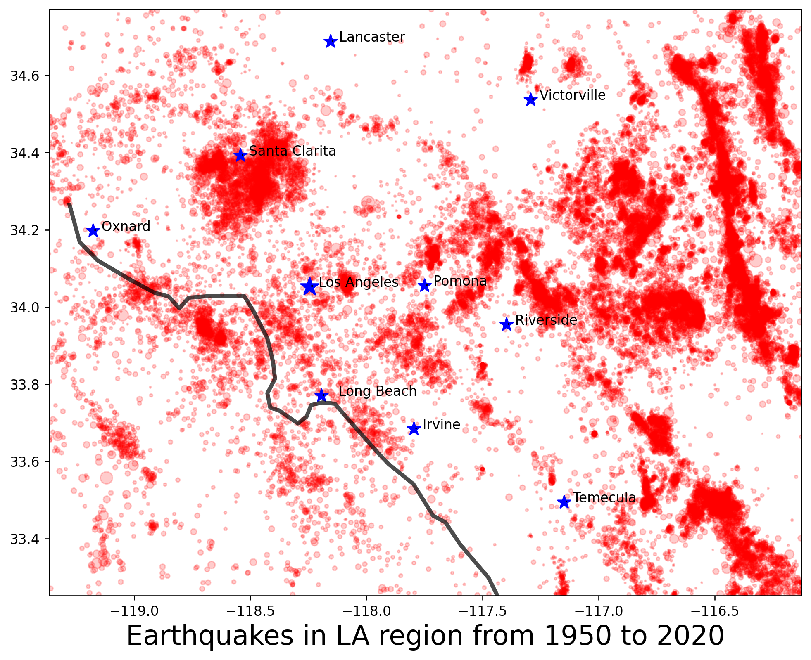
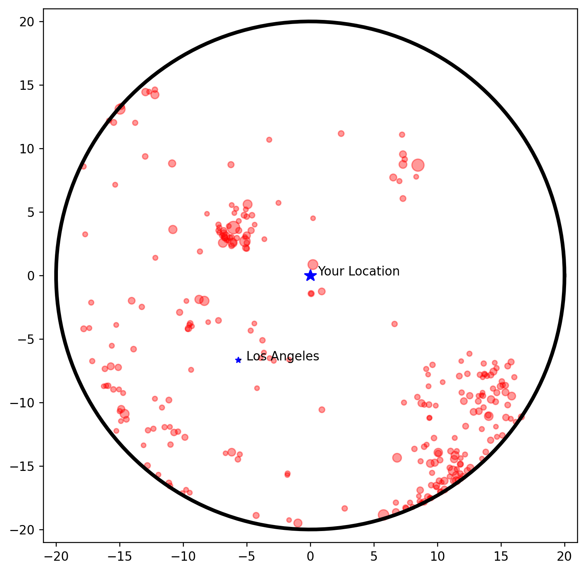
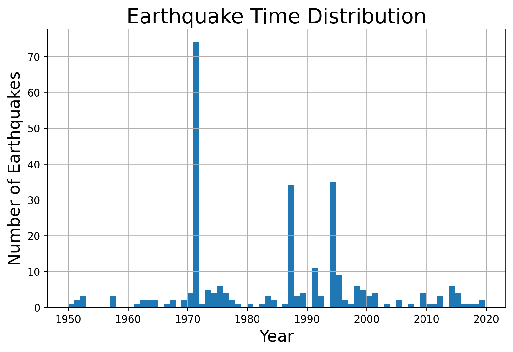

# Earthqake Viewer and Risk Assessment

### Problem Statement
Earthquakes are a part of life in southern California. It may never be possible to predict when and where earthquakes will occur, but the historical earthquake record can be used to estimate earthquake risk within a region. By looking at spatial and temporal trends in the greater Los Angeles area it is possible to see some clear patterns in earthquake distribution. These observations are useful in assessing the earthquake risk in a given location.

### Data
The data comes from the USGS database and includes 44,430 earthquakes from the Los Angeles region over the time interval from January 1, 1950 to January 29, 2020.  The main attributes used in this model are the latitude, longitude, magnitude, and depth.  The map below shows all of the earthquakes in the region and time range.

### Repository Contents
The table below outlines the files found in this repository

| File | Description |
| - | - |
| eq_viewer.ipnyb | This notebook is for plotting earthquake locations and evaluating recurrence interval | 
| eq_data.csv | Subset of USGS earthquake database, focused on Los Angeles region |
| LAcoast.csv | Google Earth kml file of the southern California coastline |
| cities.csv | Spreadsheet of citynames and coordinates for select locations in southern California |
| eq_risk.py | A python script version of eq_viewer.ipnb |

### Output
The earthquake viewer script prompts the user to enter the latitude and longitude of their location of interest as well as the minimum magnitude of earthquake they want in their search. The program will generate three plots, one showing the locations and magnitudes, another showing the time distribution, and a third showing the depth of the earthquakes in the region.  Examples are shown below for the following query for the city of Pasadena.

| Longitude | Latitude | Minimum Magnitude |
| - | - | - |
| -118.145 | 34.148 | 3 |

This plot shows the earthquakes that fall within a 20 mile radius of the specified location (in this case Pasadena) and have a minimum magnitude of 2.  The size of the markers corresponds to the magnitude of the earthquake.

This plot shows the time distribution from 1950-2020 of the earthquakes in the region of interest.

This plot shows the depth of the earthquakes in the region of interest, south is the the left and north is to the right.

Future versions will incorporate a Google Maps address search so the user does not need to know the exact latitude and longitude of their location of interest.  The user will also be able to specify the radius around that location they would like to see data from.

## EQ_swarm

- number
- mean/stddev year (histogram)
- mean/stddev mag
- 3D depth map of swarms, 
- mean/stddev depth

## EQ_zones

- high density dbscan
- 3D depth, colored by age, size by mag
- Cycles?

## Synthesis

- when user inputs location, tell closest major earthquake zone and closest most recent swarm
